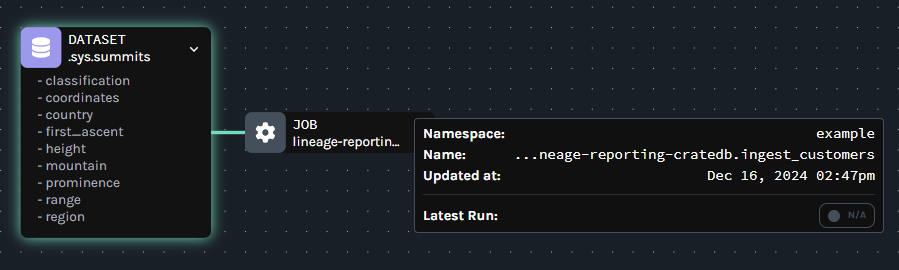

(marquez)=
# Marquez

:::{include} /_include/links.md
:::

[OpenLineage] is an open source industry standard framework for data lineage. It standardizes the definition of data lineage, the metadata that makes up lineage data, and the approach for collecting lineage data from external systems.

[Marquez] is OpenLineage's lineage repository reference implementation.

Among other tools, OpenLineage integrates with [Airflow] to collect DAG lineage metadata so that inter-DAG dependencies are easily maintained and viewable via a lineage graph, while also keeping a catalog of historical runs of DAGs.

## Data lineage with CrateDB

Today I want to share an example of how we can run Airflow DAGs against a CrateDB database and view lineage data.

### Setup

We will need Docker Compose v2, to install it, make it available to all users in the system, check the installed version, or upgrade from v1, please refer to [the Docker documentation on this topic].

Let's now start Marquez:

```bash
git clone https://github.com/MarquezProject/marquez && cd marquez
sudo ./docker/up.sh
```

While Marquez starts, let's open another terminal and proceed installing the Astro CLI for Airflow:

```bash
curl -sSL install.astronomer.io | sudo bash -s
```

Let's initialize a project folder:

```bash
mkdir datalineageeval
cd datalineageeval
astro dev init
```

We will use the PostgreSQL wire protocol to connect to CrateDB:

```bash
echo 'apache-airflow-providers-postgres' >> requirements.txt
```

Let's now configure Airflow to use Marquez as the lineage repository and connect to it via the Docker bridge interface:

```bash
cat <<EOF >>.env
OPENLINEAGE_URL=http://172.17.0.1:5000
OPENLINEAGE_NAMESPACE=example
EOF
```

We will use the Airflow web interface, if you are running this on a headless system where you do not have access to a web browser you can run:

```bash
astro config set airflow.expose_port true
``` 

Astro also needs an internal PostgreSQL instance, but port 5432 is taken by Marquez's own internal database, so we will configure Astro to use port 5435 for its internal database:

```bash
astro config set postgres.port 5435
sudo astro dev start
```

And we will start a single-node local CrateDB instance using port 5436 for the PostgreSQL wire protocol interface:

```bash
sudo docker run -d --name cratedb --publish=4200:4200 --publish=5436:5432 --env CRATE_HEAP_SIZE=1g crate/crate:5.9.5 -Cdiscovery.type=single-node
```

(NB this will return immediately once the image is downloaded but CrateDB may take a few seconds to start)


Let's now use the CrateDB CLI to prepare the tables we will use for this example:

```bash
sudo apt install python3-pip
sudo pip install crash
crash
```

```sql
CREATE TABLE public.Customers (
	CustomerID TEXT PRIMARY KEY NOT NULL DEFAULT gen_random_text_uuid()
	,CustomerName TEXT NOT NULL
	,Country TEXT	
	);
	
CREATE TABLE public.Invoices (
	InvoiceID TEXT PRIMARY KEY NOT NULL DEFAULT gen_random_text_uuid()
	,date TIMESTAMP DEFAULT now()
	,CustomerID TEXT	
	);
	
CREATE TABLE public.Products (
  ProductID TEXT PRIMARY KEY NOT NULL DEFAULT gen_random_text_uuid(),
  Description TEXT,
  applicable_tax_percentage REAL
);

CREATE TABLE public.Invoice_items (
  InvoiceID TEXT,
  ProductID TEXT,
  quantity  SMALLINT,
  unit_price REAL,
  PRIMARY KEY (InvoiceID,ProductID)
);
```

Now press Ctrl+D to exit the CrateDB Shell.

### Usage

We are now going to configure Airflow to connect to CrateDB.

Open a web browser and navigate to port 8080 on the machine where you are running Astro, for instance `http://localhost:8080/`.
Login with username admin and password admin.

Under "Admin" select "Connections".
Click the blue plus sign button to create a new connection and enter the following details:

```
Connection Id: cratedb_default
Connection Type: Postgres
Host: 172.17.0.1
Login: crate
Port: 5436
```

Click the Save button.

Now we will create a DAG.
Let's go back to the `datalineageeval` folder, and run the following:

```bash
cat <<EOF >> dags/data_ingestion.py
```

```python
from datetime import datetime, timedelta

from airflow.models.dag import DAG
from airflow.providers.postgres.operators.postgres import SQLExecuteQueryOperator

with DAG(
    "lineage-reporting-cratedb",
    start_date=datetime(2024, 6, 28),
    max_active_runs=1,
    schedule="@daily",
    default_args={"retries": 1, "retry_delay": timedelta(minutes=1)},
    catchup=False,
):

    ingest_customers = SQLExecuteQueryOperator(
        task_id="ingest_customers",
        conn_id="cratedb_default",
        sql="""
            INSERT INTO public.Customers (CustomerName,Country)
                                SELECT CONCAT(mountain,' Corp.')
                                        ,country
                                FROM sys.summits
                                LIMIT 100;
        """,
		inlets=[{'namespace': 'example', 'name': 'sampledata'}],
		outlets=[{'namespace': 'example', 'name': 'customers_table'}]
    )

    ingest_invoices = SQLExecuteQueryOperator(
        task_id="ingest_invoices",
        conn_id="cratedb_default",
        sql="""
           INSERT INTO public.Invoices(date,CustomerID)
                        SELECT ('2022-01-01'::TIMESTAMP)+concat(floor(random()*1000),' DAYS')::INTERVAL
                                ,(SELECT CustomerID FROM public.Customers ORDER BY random()+a.b LIMIT 1)
                        FROM GENERATE_SERIES(1,1000) a(b);
        """,
		inlets=[{'namespace': 'example', 'name': 'customers_table'}],
		outlets=[{'namespace': 'example', 'name': 'invoices_table'}]
    )

    ingest_products = SQLExecuteQueryOperator(
        task_id="ingest_products",
        conn_id="cratedb_default",
        sql="""
           INSERT INTO public.Products(Description,applicable_tax_percentage)
                        SELECT CONCAT('Product ',a.b)
                                ,(floor(random()*10)+15)/100.0
                        FROM GENERATE_SERIES(1,10) a(b);
        """,
		inlets=[{'namespace': 'example', 'name': 'more_sample_data'}],
		outlets=[{'namespace': 'example', 'name': 'products_table'}]			
    )

    ingest_invoice_items = SQLExecuteQueryOperator(
        task_id="ingest_invoice_items",
        conn_id="cratedb_default",
        sql="""
           INSERT INTO public.Invoice_items (InvoiceID,ProductID,quantity,unit_price)
                                SELECT InvoiceID,ProductID
                                        ,1+ceiling(random()*4)
                                        ,random()*1000
                                FROM public.Invoices
                                INNER JOIN public.Products ON random()>0.5;
        """,
		inlets=[{'namespace': 'example', 'name': 'invoices_table'},{'namespace': 'example', 'name': 'products_table'}],
		outlets=[{'namespace': 'example', 'name': 'invoice_items_table'}]			
    )

    refresh_customer_table = SQLExecuteQueryOperator(
        task_id="refresh_customer_table",
        conn_id="cratedb_default",
        sql="REFRESH TABLE public.Customers;",
    )

    refresh_invoices_table = SQLExecuteQueryOperator(
        task_id="refresh_invoices_table",
        conn_id="cratedb_default",
        sql="REFRESH TABLE public.Invoices;",
    )

    refresh_products_table = SQLExecuteQueryOperator(
        task_id="refresh_products_table",
        conn_id="cratedb_default",
        sql="REFRESH TABLE public.Products;",
    )

    ingest_customers >> refresh_customer_table >> ingest_invoices >> refresh_invoices_table
    refresh_invoices_table >> ingest_invoice_items
    ingest_products >> refresh_products_table >> ingest_invoice_items
```

```bash
EOF
sudo astro dev restart
```

Let's now go back to the Airflow web interface, navigate to "DAGs" on the top left corner, then identify the new `lineage-reporting-cratedb` DAG and use the "play" button to execute it.

When the execution of the DAG completes, "Recent Tasks" should show 7 tasks with success status.

Let's now navigate to the Marquez web interface at http://localhost:3000/ (replace localhost with the appropriate hostname if this is not running locally).

On the upper right corner, select `example` instead of `default`.

You can now see all lineage graphs and events for this setup.

{h=180px}


[Marquez]: https://github.com/MarquezProject/marquez
[OpenLineage]: https://openlineage.io/
[Airflow]: https://airflow.apache.org/
[the Docker documentation on this topic]: https://docs.docker.com/compose/install/linux/